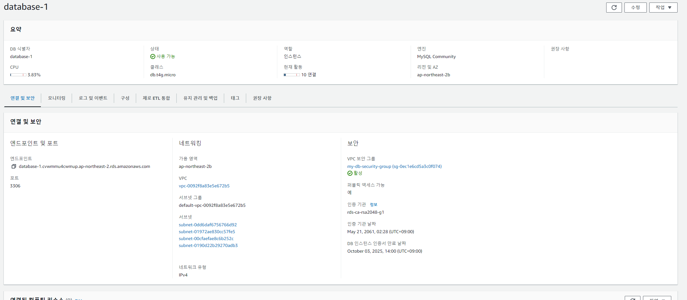
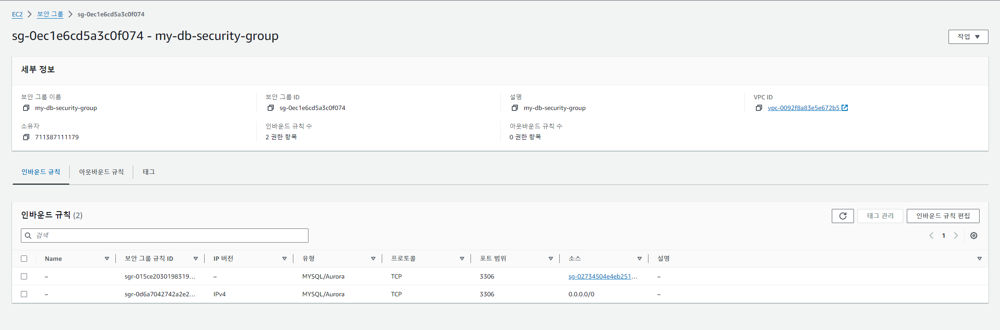
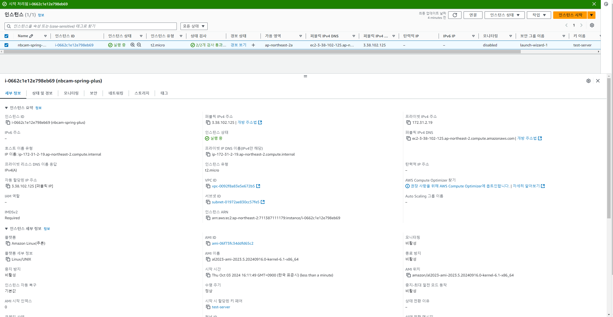
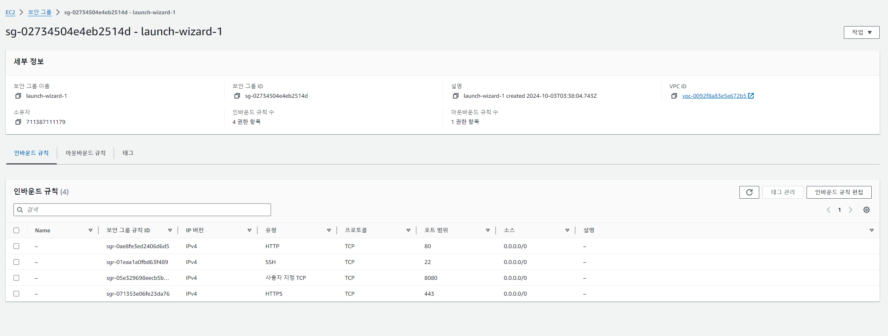
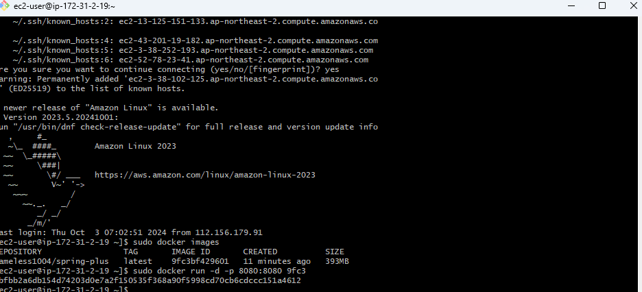
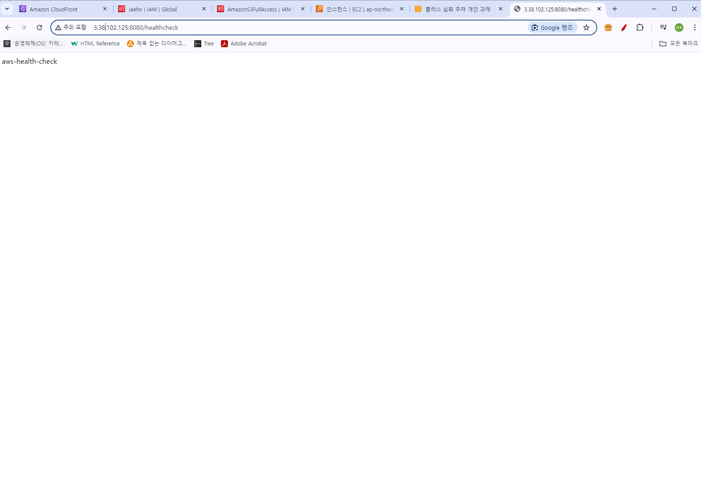

# SPRING PLUS
# RDS 세팅

# EC2 세팅

# 헬스체크

# 쿼리 개선
## 100만건 유저 닉네임 조회 성능 개선
### 시간 계산 방법
* 100회 1 ~ 1,000,000 아이디 랜덤 선택
* 해당 아이디 검색
* 1000번 시간측정 후 평균값
### 기존 성능
 
| MySQL       | 인텔리제이    |
|-------------|----------|
| 1512.7672ms | 1264.4ms |

### 개선 후 성능
* 개선 방법
  * users테이블의 nickname컬럼에 index 생성

| MySQL           | 인텔리제이     |
|-----------------|-----------|
| 0.3326ms        | 1.813ms   |

* MySQL 기준: 기존 대비 4548.5배 성능 향상
* 인텔리제이 기준: 697.5배 성능 향상 
